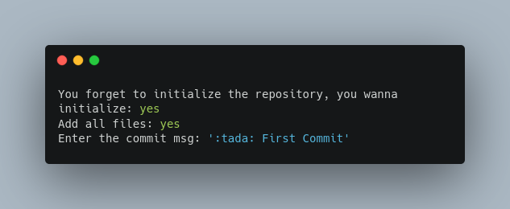
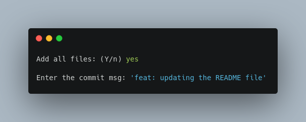

# G4t
> A simple cli app to help you with git.

<<<<<<< HEAD
[](https://opensource.org/licenses/MIT)
[](https://www.codefactor.io/repository/github/freazesss/g4t/overview/master)
=======
<p float="left">
  
   
</p>
>>>>>>> 2e87e7f1264a986da01a185cd0b7e61183d7df1d

## Installation

```sh
gem install colorize
gem install tty-prompt
ruby main.rb
```

<<<<<<< HEAD
## Contributing

1. Fork it.
2. Create your feature branch (`git checkout -b feature/fooBar`)
3. Commit your changes (`git commit -am 'Add some fooBar'`)
4. Push to the branch (`git push origin feature/fooBar`)
5. Create a new Pull Request
=======
3. run the app using:

```zsh
ruby main.rb
```

**Mit License ©**
>>>>>>> 2e87e7f1264a986da01a185cd0b7e61183d7df1d
