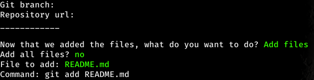

# G4T Docs

The G4T is a program what can change your workflow with git, mostly if you are a noob with git.

The main page of G4T is it:

If you don't have a `.git` in your directory, the mainpage will be:

# Options

## Clone a repo

Clone a repository from a certain user

## Initialize a repo

Initialize a new git repository

## Add Remote Address

Add the remote address from git repository

## Add Files

Add files to the stage stack

You can add all files, or select the files

Adding all files:

Adding file by file

## Commit Files

Commit files to your local repository

## Push files to branch

Push your files in staging to a branch, like the `master` branch

## Show Git Status

Get the actual git status.

## Show Git Log

Get the git log

## Show the Last Commit

Show the last commit from the log

## Remove a file

Remove a file from the git

## Show Diff

Show the actual git diff

## Change Branch

Change the actual git branch

## Git Pull Changes

Get the changes from the remote repository, and apply it to the local repository

## Restore a file

Deleted a file and you need it back? restore the file with this option.

## Close

Close the `g4t`

